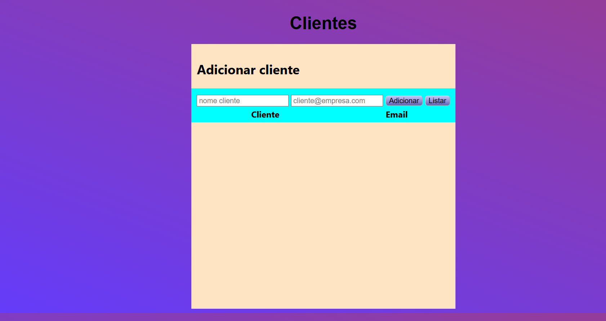

# Gerenciado de clientes com crudcrud
 para usar alterar o {token-api-crudcrud} para o atual token no seu crudcrud, ja que expirou e eu nem pude de fato finalizar a tempo a aplicação ja que após 100 requests ele bloqueia

